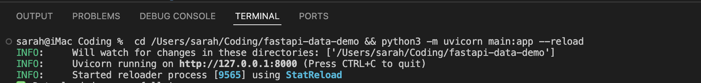
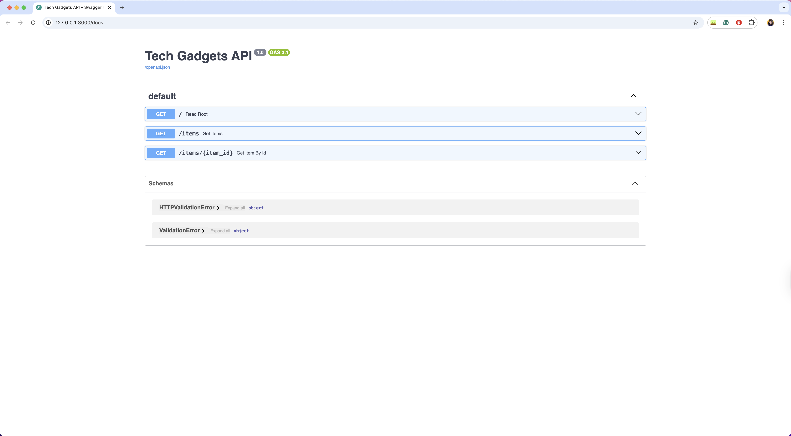
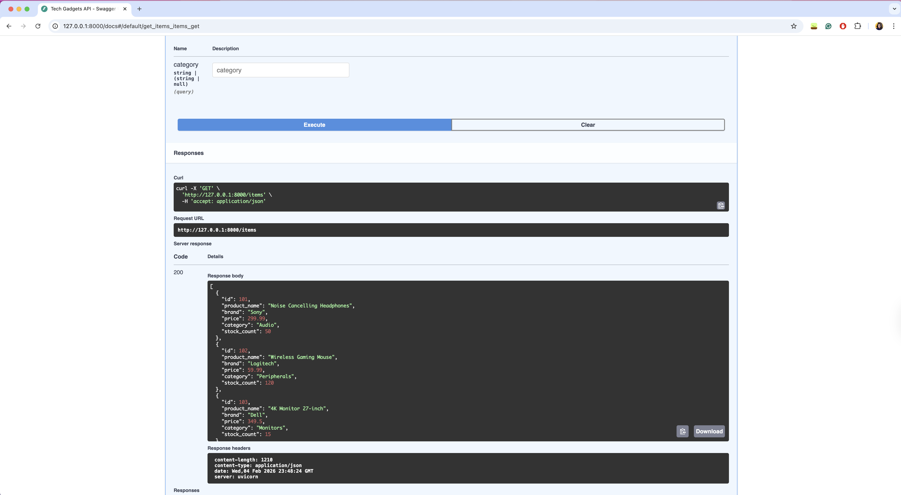
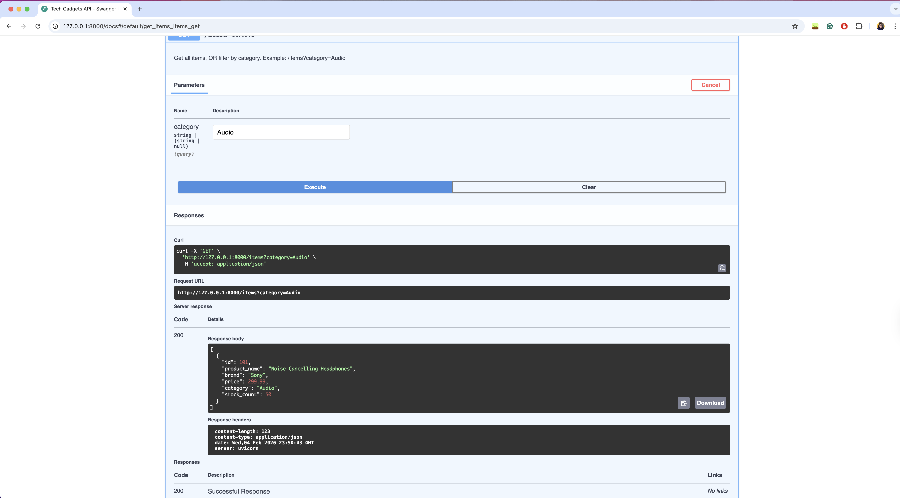
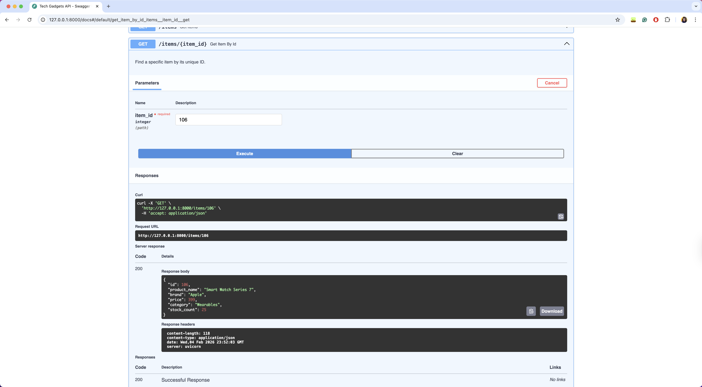

# 📱 Tech Products API (Backend Demo)

**Difficulty Level:** 🟢 Beginner-Friendly | **Estimated Time:** ⏱️ 15-20 minutes

## 🎯 Learning Objectives
By completing this tutorial, you will:
- ✅ Understand how REST APIs work and why they're important
- ✅ Build a working API backend using FastAPI
- ✅ Learn to handle HTTP GET requests with path and query parameters
- ✅ Gain practical experience with Python data processing using Pandas
- ✅ Test APIs using interactive Swagger/OpenAPI documentation
- ✅ Understand virtual environments and dependency management

---

## 1. Overview
This project demonstrates a high-performance REST API backend built with **Python**, **FastAPI**, and **Pandas**. It simulates an e-commerce inventory system where users can:
* **Retrieve** a full list of tech products.
* **Filter** products by category (e.g., "Audio", "Monitors").
* **Lookup** specific items by their unique ID.

**Tech Stack:**
* **FastAPI:** For handling HTTP requests and routing.
* **Pandas:** For efficient in-memory data processing (simulating a database).
* **Uvicorn:** As the ASGI server to run the application.

---

## 2. Key Technologies Explained

### What is a REST API?
Think of a REST API like a **waiter in a restaurant**:
- You (the customer) sit at a table and look at the menu
- You tell the waiter what you want to order
- The waiter takes your request to the kitchen
- The kitchen prepares your food
- The waiter brings it back to you

In our tech world:
- **You** = A website or mobile app
- **The waiter** = The REST API (our FastAPI code)
- **The kitchen** = The database (our data.csv file)
- **The menu** = Available endpoints (actions you can request)

**Simple example:** When you open Instagram and see photos, the Instagram app sends a request to Instagram's API saying "Give me the latest photos." The API fetches them from the database and sends them back. That's exactly what we're building!

In this project, we use **GET requests** to retrieve product data - like asking the waiter "Can I see the appetizers menu?" instead of ordering food.

### Why FastAPI?
FastAPI is a modern Python web framework that's significantly faster than alternatives like Flask or Django. It automatically generates interactive API documentation (Swagger UI), validates data types, and provides async support for high-performance applications.

### What is Swagger/OpenAPI?
Swagger UI is an interactive documentation interface that FastAPI generates automatically. It lets you test API endpoints directly in your browser without writing any frontend code or using tools like Postman.

### Role of Pandas
Pandas is typically used for data analysis, but here it serves as an in-memory database. It loads the CSV file and allows fast filtering and querying operations, simulating what a real database would do.

---

## 3. Prerequisites & Setup Instructions

### Prerequisites
* **Python 3.8+** 
  * **Mac / Linux:** Verify with `python3 --version`
  * **Windows:** Verify with `python --version`

### Installation & Setup

**Step 1: Prepare the Files**
Ensure the following files are in your project folder:
* `main.py` (Application logic)
* `data.csv` (Data source)
* `requirements.txt` (Dependencies)

**Step 2: Create Virtual Environment**
Run the command for your operating system to create an isolated sandbox:

* **Mac / Linux:**
  ```bash
  python3 -m venv venv
  source venv/bin/activate
  ```

* **Windows:**
  ```bash
  python -m venv venv
  .\venv\Scripts\activate
  ```
(You should see `(venv)` appear at the start of your terminal line).

**Step 3: Install Dependencies**
```bash
python -m pip install -r requirements.txt
```

**Step 4: Start the Server**
```bash
uvicorn main:app --reload
```
You should see: `Uvicorn running on http://127.0.0.1:8000`



Visiting http://127.0.0.1:8000 will only show a raw JSON message.

---

## 4. Tutorial Walkthrough
We use the automatic Swagger UI to test the API without needing a frontend.

**Step 1: Open the Interface**  
Navigate to http://127.0.0.1:8000/docs in your browser.



**Step 2: Get All Items**
1. Click on the blue bar **GET /items**.
2. Click **Try it out** -> **Execute**.
3. **Result:** The API returns a JSON list of all products from `data.csv`.



**Step 3: Filter by Category**
1. In the `category` parameter field, type: `Audio`
2. Click **Execute**.
3. **Result:** The API returns only the "Sony Noise Cancelling Headphones".



**Step 4: Lookup Specific Item**
1. Scroll to **GET /items/{item_id}**.
2. Click **Try it out**.
3. Enter ID: `106` (Apple Watch).
4. Click **Execute**.
5. **Result:** The API returns details for the "Smart Watch Series 7".



---

## 5. Troubleshooting

**Error: "Module not found: pandas"**
* **Cause:** You are not inside the virtual environment.
* **Fix:** Run `source venv/bin/activate` (Mac) or `.\venv\Scripts\activate` (Windows).

**Error: "command not found: uvicorn"**
* **Cause:** Dependencies were installed globally or not at all.
* **Fix:** Activate the venv and run `pip install -r requirements.txt` again.

**Error: "Address already in use"**
* **Cause:** Another instance of the server is running.
* **Fix:** Close other terminal windows or change the port: `uvicorn main:app --reload --port 8001`.

---

## 6. Clean-up
To properly close the project when finished:

1. **Stop the Server:** Go to your terminal and press `Ctrl + C`.

2. **Exit the Environment:** Type the following command to leave the virtual sandbox:
   ```bash
   deactivate
   ```

3. **(Optional) Delete Environment:** If you want to save space, you can delete the `venv` folder safely. It can always be recreated using the Setup Instructions.

---

## 7. Security & Best Practices

⚠️ **Important: This is a Learning Demo**
This project is designed for educational purposes and local development only. Before deploying to production:

* **Add Authentication:** Implement OAuth2/JWT tokens to secure endpoints
* **Rate Limiting:** Prevent abuse by limiting requests per user/IP
* **Input Validation:** Sanitize all user inputs to prevent injection attacks
* **HTTPS Only:** Never expose APIs over HTTP in production
* **Environment Variables:** Store sensitive data (API keys, passwords) in `.env` files, never in code
* **CORS Configuration:** Restrict which domains can access your API
* **Error Handling:** Don't expose stack traces or internal errors to users

**Data Privacy Considerations:**
* This demo uses sample data only
* In real applications, comply with GDPR, CCPA, and relevant data protection laws
* Never store sensitive user data (passwords, credit cards) in CSV files
* Implement proper database encryption and access controls

---

## 8. Next Steps & Further Learning

Ready to build on what you've learned? Here are recommended next steps:

1. **Add More Endpoints:** Create POST, PUT, DELETE operations for full CRUD functionality
2. **Connect a Real Database:** Replace CSV with PostgreSQL or MongoDB
3. **Add Authentication:** Implement user login with JWT tokens
4. **Build a Frontend:** Create a React or Vue.js interface to consume your API
5. **Deploy Online:** Host on platforms like Railway, Render, or AWS
6. **Add Testing:** Write unit tests with pytest

**Recommended Resources:**
* [FastAPI Full Tutorial](https://fastapi.tiangolo.com/tutorial/) - Official comprehensive guide
* [REST API Design Best Practices](https://stackoverflow.blog/2020/03/02/best-practices-for-rest-api-design/) - Industry standards
* [Python Testing with pytest](https://realpython.com/pytest-python-testing/) - Writing reliable tests

---

## 9. License & Usage

**License:** MIT License  
You are free to use, modify, and distribute this code for personal or commercial projects.

**Attribution:**
* FastAPI © 2018-2024 Sebastián Ramírez (MIT License)
* Pandas © 2008-2024 AQR Capital Management, LLC, Lambda Foundry, Inc. and PyData Development Team (BSD 3-Clause License)
* Project structure inspired by FastAPI official tutorials

**Academic Integrity Notice:**  
If using this project for coursework, ensure you understand all code and comply with your institution's academic integrity policies. Cite this repository if required.

---

## 10. References
* **FastAPI Documentation:** https://fastapi.tiangolo.com/
* **Pandas Documentation:** https://pandas.pydata.org/docs/
* **Uvicorn Deployment:** https://www.uvicorn.org/
* **Python venv Module:** https://docs.python.org/3/library/venv.html
* **REST API Design:** https://restfulapi.net/
* **HTTP Status Codes:** https://developer.mozilla.org/en-US/docs/Web/HTTP/Status
